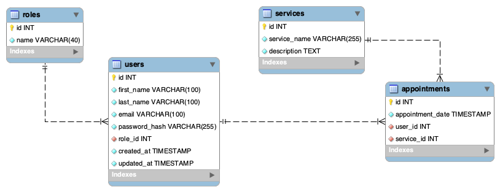

# TATTOO STUDIO searching engine

This is the FOURTH PROJECT of the Full Stack Development Bootcamp with Geekshubs Academy.

<div align="center">

</div>

<details>
  <summary>Table of Contents 🗂️</summary>
  <ol>
    <li><a href="#project-description-es">Description (ES)</a></li>
    <li><a href="#challenge">Challenge</a></li>
    <li><a href="#database-diagram">Database diagram</a></li>
    <li><a href="#instalation-local">Instalation</a></li>
    <li><a href="#endpoints">Endpoints</a></li>
    <li><a href="#project-development">Project development</a></li>
    <li><a href="#author">Author / Contact </a></li>
  </ol>
</details>


## Project description (ES)
##### Appointment management tool for a tattoo studio

<details>
  <summary>Read about it (only in spanish)</summary>
  <br/>
<b>Gestión de citas para un estudio de tatuajes:</b>
<br /><br />
El departamento de producto nos ha encomendado desarrollar el backend
correspondiente al sistema de gestión de citas para un estudio de tatuajes.

Los usuarios podrán registrarse en la aplicación, iniciar sesión y acceder a su área
personal. Dentro de su área, podrán visualizar una lista de las citas programadas
para servicios de tatuajes y piercing, así como crear nuevas citas para diversos
servicios que ofrece el estudio.

Además, se contará con una sección de usuario donde podrán acceder a sus datos
personales, visualizables únicamente por el propio usuario (perfil).
</details>


## Challenge
- Create Endpoints (registration, login, CRUD):
- Migrations & Seeders for all tables.
- All non-public endpoints with corresponding middlewares.


## Database diagram



## Instalation (local)
1.  Clone this repository
2.  Run ` $ npm install ` in terminal
3.  Conect repository with database 
4.  Run migrations:  ```$ npm run run-migrations```
5.  *Run seeders:
    ```$ npm run seed-roles```
    ```$ npm run seed-users```
    ```$ npm run seed-services```
    ```$ npm run seed-appointments```
6.  Start server:   ``` $ npm run dev ``` 

##### *Alternative to step 5:
- you can select and copy ALL TEXT from the `"data.sql"` file
- paste it into MySQL 
- execute it (⚡ button) to populate a smaller example of the database
    >file route: `./src/database/seeders/data.sql `


## Endpoints

<details>
<summary>AUTH routes</summary>

-   REGISTER new user
    
        POST http://localhost:4002/api/auth/register

    body:
    
    ``` js
        {
            "first_name": "Sergio",
            "last_name": "Sergio",
            "email": "sergio@sergio.com",
            "password": "111111"
        }
    ```

-   LOGIN user

        POST http://localhost:4002/api/auth/login
        
    body:

    ``` js
        {
            "email": "sergio@sergio.com",
            "password": "111111"
        }
    ```
</details>
<details>
<summary>USERS routes</summary>

-   GET ALL USERS  (including dinamic query search)

        GET http://localhost:4002/api/users
        GET http://localhost:4002/api/users?email=example@domain.com

- GET USER BY ID

        GET http://localhost:4002/api/users/:id

-   UPDATE PROFILE (for the currently logged user)

        PUT http://localhost:4002/api/users/self

    body:

    ```js
        {
            "first_name": "name",
            "last_name": "surname",
            "email": "something@domain.com",
            "password": "111111"
        }
    ```
-   UPDATE USER BY ID

        PUT http://localhost:4002/api/users/:id

-   UPDATE USER'S ROLE

        PUT http://localhost:4002/api/users/:id/:roleId

-   DELETE USER BY ID

        DELETE http://localhost:4002/api/users/:id
</details>
<details>
<summary>SERVICES routes</summary>

-   CREATE A NEW SERVICE

        POST http://localhost:4002/api/services

-   GET ALL SERVICES

        GET http://localhost:4002/api/services

-   UPDATE SERVICE BY ID

        UPDATE http://localhost:4002/api/services/:id

-   DELETE SERVICE BY ID

        DELETE http://localhost:4002/api/services/:id
</details>
<details>
<summary>APPOINTMENTS routes</summary>

-   CREATE A NEW APPOINTMENT

        POST http://localhost:4002/api/appointments

-   GET ALL APPOINTMENTS

        GET http://localhost:4002/api/appointments

-   GET APPOINTMENTS BY ID

        GET http://localhost:4002/api/appointments/:id

-   UPDATE APPOINTMENTS BY ID

        UPDATE http://localhost:4002/api/appointments/:id

-   DELETE APPOINTMENTS BY ID

        DELETE http://localhost:4002/api/appointments/:id

</details>


## Project Development:

<details>
  <summary>1. SQL - Database design:</summary>
    
-   Analyze the task to find the purpose of the database and gather all requirements
-   Concept design: create an Entity-Relationship Diagram where we
define tables, their attributes, and the relationships with one another.
-   Normalization: eliminate redundancy, identify primary keys (PK) and foreign keys (FK)
-   Logical thinking: decide what can and cannot be 'NULL' (not required) and which are 'UNIQUE' fields
</details>

<details>
  <summary>2. DOCKER - Creating a container</summary>

-   Install docker
- Create a container
    > docker run -d -p 3306:3306 --name <container-name> -e MYSQL_ROOT_PASSWORD=<your_password> mysql
- Access it
    > mysql -h localhost -P 3306 -u root -p
you will need -h (host), -P (port), -u (username) and -p (password)
- Execute it
    > docker exec -it mysql-pruebas bash
</details>

<details>
  <summary>3. EXPRESS - Create a server connection</summary>

- We initiate NODE:  `$ npm init` 
    This creates 'package.json' where all the dependencies will be stored.

- We run the command: `$ npm install express --save`
    This creates 'package-lock.json' and the 'node_modules' folder

- We create the folder '.gitignore' and add '/node_modules' inside
    This blocks the heavy folder from being upload to github with the rest of the project.

- We install TYPESCRIPT (as developers) `$ npm install typescript -D`

- We create the 'tsconfig.json' file: `$ npx tsc --init`

- We install types /express & node: `$ npm install @types/express @types/node -D`

- We install dependencies to compile TS (nodemon): `$ npm install ts-node nodemon -D`

- We add a shortcut to the package.json's scripts:
    > "dev": "nodemon ./src/server.ts"

- We create the file '.env' with the PORT (of the server) and add '.env' to the '.gitignore'.

    Also add a copy '.env.sample' where we will storage a blueprint of data, without the sensitive information (in this case: 'PORT= ')

- We install 'dotenv': `$ npm i dotenv`
    This gets added to the dependencies and will grab data from the .env file
</details>

<details>
  <summary>4. DOTENV - Connect to the DB</summary>

- We create the folder 'src' with a 'server.ts' file inside.
    The main function connects to the server `startServer();`<br/>
- We link a new file called `app.ts` to separate responsabilities.<br/>
-   In this file we write the following code:

    ```js
    import express from "express";
    import dotenv from "dotenv";
    import { Request, Response } from "express";
    
    // links the .env folder
    dotenv.config(); 

    // runs server connection
    const app = express(); 

    // parses responses to .json)
    app.use(express.json()); 

    // sets up the connection port
    const PORT = process.env.PORT || 4002; 

    // server is up and listening to any upcomming request
    app.listen(3000, () => console.log('Servidor levantado en 3000')); 


    // testing request - 'Hello world' means we are ready to go!
    app.get('/', (req: Request, res: Response) => {
        res.send('Hello world!')
    }); 
    ```

- We run the server using the previously created nodemon shortcut: `$ npm run dev`
</details>

<details>
  <summary>5. MySQL Workbench</summary>

- We open the workbench and run the following commands:

    ```sql
    CREATE DATABASE <project_name>;
    USE <project_name>;
    ```
</details>

<details>
  <summary>6. MIGRATIONS & MODELS</summary>

- Creating MIGRATIONS [Data Definition Language (DDL): with typeorm]: `./src/database/migrations`
- Adding them to `DataSource.migrations` in the `db.ts` file: `Role, User, Service, Appointment`
- Creating MODELS (entities) [Data Manipulation Language (DML)]
- Adding them to `DataSource.entities` in the `db.ts` file: `Roles, Users, Services, Appointments`
</details>

<details>
  <summary>7. CONTROLLERS</summary>

- We create controllers (in a folder on the same level with `package.json`): 
    > `auth, roles, users, services, appointments`
</details>

<details>
  <summary>8. ROUTES</summary>

- We create routes (in `app.ts`) for CRUD (create, read, update and delete) database records.
</details>

<details>
  <summary>9. MIDDLEWARE: auth()</summary>
  
  - Additionally we need to control access to our data. We will use 'middleware' functions.

  -  `Auth` (authorisation systembased on TOKENs) will block anything that is not to be seen by the general public. In our case, it only does not affect to `register`, `login` and `getServices` (as those are the endpoints reachable without logging in)
  -  The `auth()` function verifies an encrypted TOKEN created automatically while logging in. With an active token we have access to other data.
</details>

<details>
  <summary>10. MIDDLEWARE: isSuperAdmin()</summary>
  
- We also want to grant special administrative access. With another middleware, the `isSuperAdmin()` function, we control PERMISSIONS.
- The 'superadmin' role would be able to reach all data, while Users would have a more limited reach. More levels can be implemented
</details>

<details>
  <summary>11. other INFO</summary>

- For the TOKEN to work, we create a new file `./types/index.d.ts` with the following lines:

    ```js
    export type tokenData = {
        userId: number;
        roleName: string;
    };

    declare global {
        namespace Express {
            export interface Request {
                tokenData: tokenData;
            }
        }
    }
    ```
</details>

## Author
<div align="center">
<a href = "mailto:a.sergiotorres@gmail.com"></a>
<a href="https://github.com/SergioTorresGarcia" target="_blank"></a> 
</div>